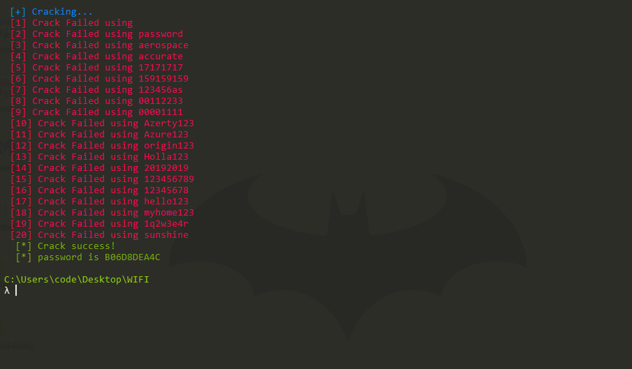

<h1 align="center">
   
  Wifi-H4ck V1.1
  
   
  </h1>
 
# <h3>By Error-4-You(E4U)</h3>

## 😒😐

                 
  
## LICENSE:
This software is free to distribute, modify and use with the condition that credit is provided to the creator (Error-4-You) and is not for commercial use.

### How to use it in your Mac ?  
This project can run well on Windows and Linux. 
Because the dependent module pywifi support for Windows and Linux but not Mac,   
here is the way to use Wifi-H4ck in Mac.  
#### Step 1. install anaconda
Go https://www.anaconda.com/distribution/ to download anaconda and install it.  

#### Step 2. Use conda to install pywifi for mac
macos_dev branch is a pywifi project for Mac with python 3.5
pyobjc is dependent module for mac pywifi module

$ conda create -n Wifi-H4ck python=3.5  
$ conda activate Wifi-H4ck    
$ git clone -b macos_dev https://github.com/Error-4-You/Wifi-H4ck.git  
$ cd pywifi  
$ pip install pyobjc   
$ pip install .  

Now pywifi module for Mac is ready in conda environment, named Wifi-H4ck  
You can enjoy Wifi-H4ck.  

### _🕷️ Available command line options_
[`CopyRight`](https://github.com/Error-4-You/)

    usage: [options]
      -h , --help           show this help message and exit
      -s , --ssid           SSID WIFI Target
      -w , --wordlist       list of passwords
      -t , --threads        number of threads #Comming soon
      -v , --version        version

-------------------------------------

<h1 align="center">
   
  
   
</h1>

# 🤬🤬

# Warning️

This tool is only for educational purpose. If you use this tool for other purposes except education we will not be responsible in such cases.

 2022 © - Error-4-You
